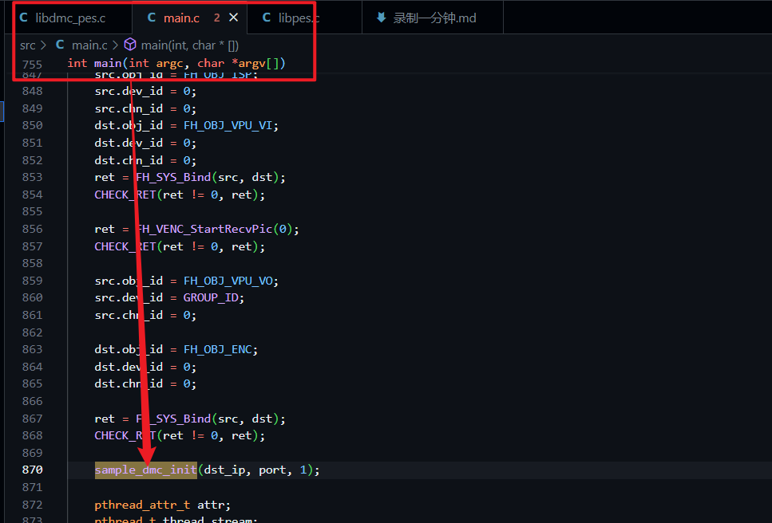
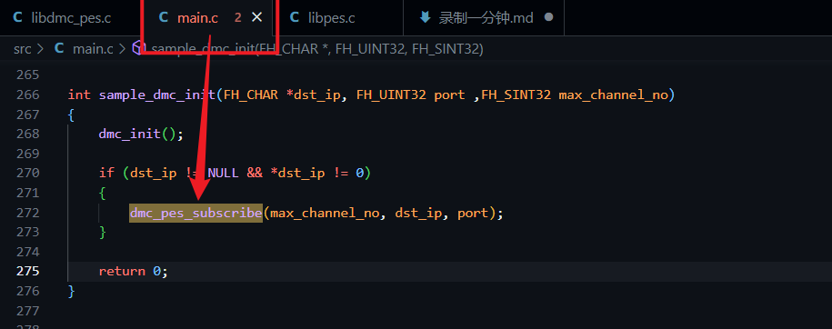
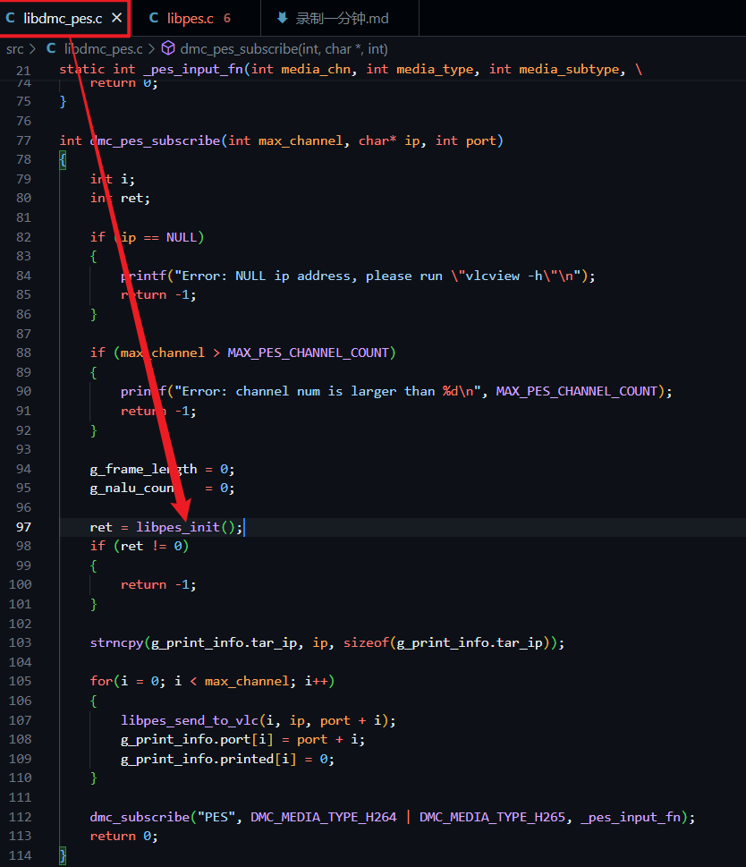
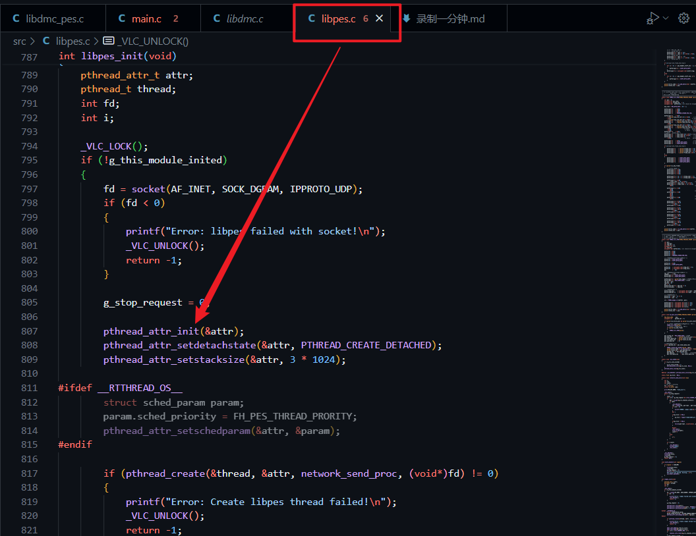

### 在设备中缓存视频

录制视频流程
1. 在main函数中调用`sample_dmc_init`

1. 在`sample_dmc_init`函数中调用`dmc_pes_subscribe`

1. 在`dmc_pes_subscribe`函数中调用`libpes_init`

1. 在`dmc_pes_subscribe`函数中调用创建线程


### 设置为缓存一分钟视频
`在libpes.c`中找到`int libpes_init(void)`，位于第787行
在其中添加定时器函数
```c
    // 注册信号处理函数
    signal(SIGALRM, alarm_handler);

    // 设置定时器为1分钟
    alarm(60);
```
`alarm(60)`代表在六十秒后，执行函数`void alarm_handler(int signum)`:
```c
void alarm_handler(int signum)
{
    if (signum == SIGALRM) 
    {
        fclose(ps_file);
        close(fd);
        g_stop_request = 0;
        printf("\n*****************************************\n \
        One minute has passed. Exiting...\n");
        exit(EXIT_SUCCESS);
    }
}
```
因为设备在推流视频时，同时将视频保存在了本地，这里`fclose`后，会把视频保存在`/home/h264.ps`，随后将其复制出即可

P.S. 我把`static FILE *ps_file = NULL;`设置成了全局变量，这样可以在不同的函数里面调用